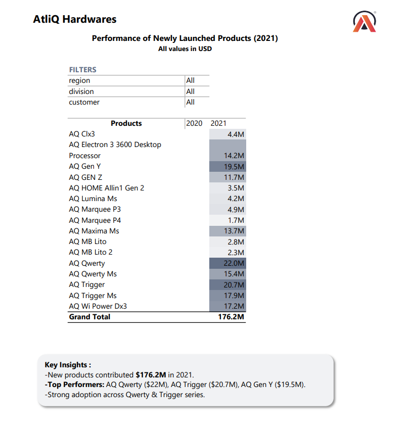
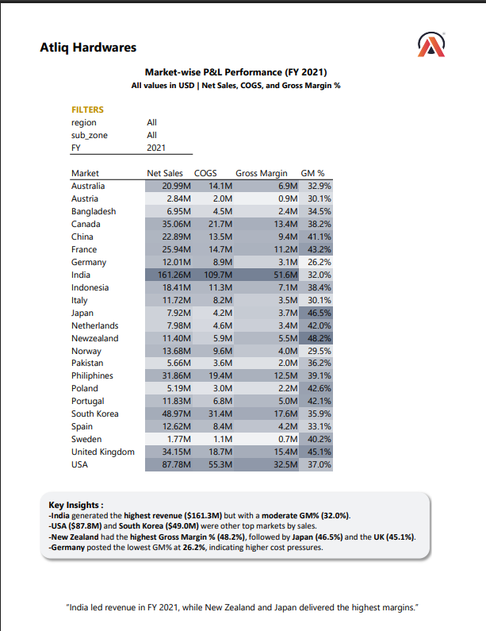

# 📊 Atliq Hardwares – Excel Sales & Finance Analytics

## 🚀 Project Overview

This project presents an end-to-end **Excel-based analytics solution** for Atliq Hardwares, focusing on both **Sales and Financial performance**.

Using **Power Query, Power Pivot, and Excel modeling**, the project transforms raw data into structured insights to support **data-driven business decision-making**.

---
## 🎯 Business Problem

The company was dealing with large volumes of scattered Excel files used for sales and financial tracking. While the data could not be removed due to business requirements, the lack of structure made it difficult to:

* Extract meaningful insights
* Track performance efficiently
* Support data-driven decision-making

As a result, management relied on manual analysis, leading to inefficiencies and delayed decisions.

With growing interest in analytics from leadership (Bruce), there was a need to transform raw Excel data into structured, insight-driven reports.

---

## 🧠 Objective

* Organize and transform scattered Excel data into structured reports
* Build Sales and Finance analytics dashboards
* Identify key performance trends and problem areas
* Enable faster and more informed business decisions

---

## 📊 Project Visuals

### Sales Report

### Finance Report

---

## 📈 Key Insights

• **PC Division** grew by **314% YoY**, reaching **$165.8M in 2021**  
• **P & A Division** contributed **$338.4M**, the largest revenue share  
• **New products** generated **$176.2M** in 2021, led by Qwerty & Trigger series  
• **India** contributed **$161.3M (~45%)**, indicating market dependency  
• **Gross margins declined in India** (42% → 32%), signaling pricing pressure  
• **New Zealand, Japan, UK** achieved highest profitability (>45% GM)

---

## 📊 Sales Analytics

📂 Folder: `/Sales Reports`

Key analyses include:

• Customer & Market Performance  
• Division-wise Sales Growth  
• Market Performance vs Target  
• Top & Bottom Product Analysis  
• New Product Performance  

---

## 💰 Finance Analytics

📂 Folder: `/Finance Reports`

Key analyses include:

• Gross Margin by Sub-Zone  
• Profit & Loss by Market  
• Regional profitability trends  

---

## 🛠 Tools & Techniques

### Technical Skills
• Microsoft Excel  
• Power Query (ETL & Data Cleaning)  
• Power Pivot (Data Modeling)  
• DAX (Calculated Measures)  
• Pivot Tables & Multi-sheet Analysis  

### Analytical Skills
• Sales & Finance KPI Analysis  
• Trend & variance analysis  
• Business storytelling  
• Insight generation for decision-making  

---

## 💡 Business Impact

This analysis helps:

• Identify high-performing products and divisions  
• Detect low-margin markets and inefficiencies  
• Improve pricing and discount strategies  
• Support expansion into high-profit regions  

---

## 📂 Project Structure

• Sales Reports → `/Sales Reports`  
• Finance Reports → `/Finance Reports`  
• Analysis Files → `/Analysis Files`  
• Visuals → `/Images`  

---

## 👨‍💻 Author

**Anshul Chaudhary**  
Aspiring Data Analyst (Finance + Analytics)  

---

## 🎯 Project Outcome

This project demonstrates the ability to:

• Build analytical solutions using Excel  
• Perform data modeling using Power Pivot  
• Translate business problems into insights  
• Communicate findings effectively  
